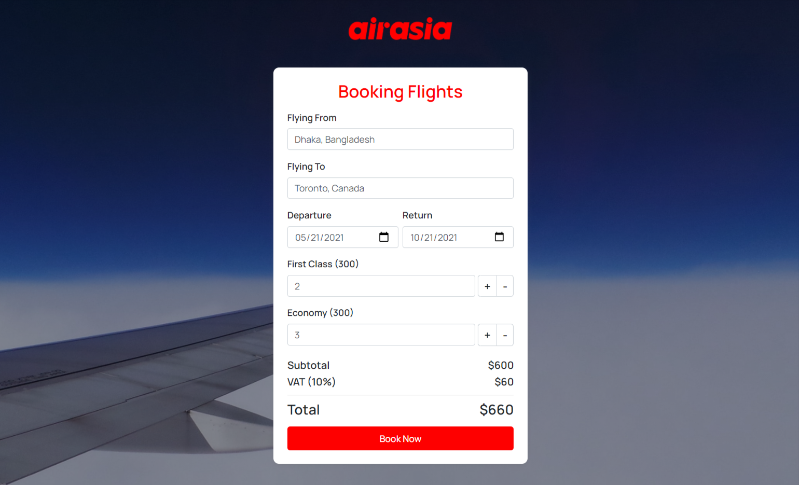
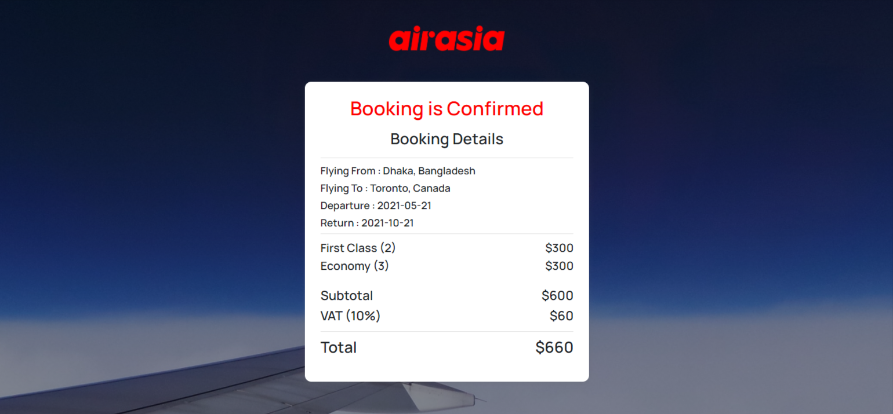

# Air Asia
## ([Live Preview](https://tayab-pabel.github.io/air-asia/))
## Features
   - It's a vanilla js project.
   - Flight booking process.
   - Calculate total cost.
   - Show booking details after booking.
   - Responsive layout.
## Technology
   - HTML
   - CSS
   - Bootstrap
   - Javascript
## Tools
   - Visual Studio Code
   - Github
   - Chrome Dev Tools
## User Interface

